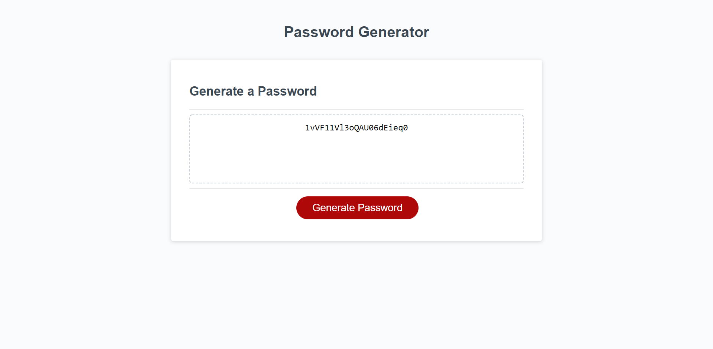

# <Password-Generator>
## Description
-This project is a password generator. It will take in a user input for password length and user prompts for which character types to include in the password. It will then generate a random mix of those characters on the page.

- This project taught me a lot about functions, if statements, arrays and having those types nested within each other to create a functional outcome.
## Table of Contents (Optional)
- [Installation](#installation)
- [Usage](#usage)
- [Credits](#credits)
- [License](#license)
## Installation
- Not Applicable
## Usage
- To use this generator simply press the generate button and then answer the prompts that appear on screen. Your generated password should appear in the middle on the application.
- Deployed link: https://jdomindev.github.io/password-generator/
- Repo link: https://github.com/jdomindev/password-generator
- Screenshot:
    
## Credits
- Thanks to my sister Maria Dominguez for her insightful comments and on sending me in the right direction through my many failed attempts.
- Also thanks to Adam Khoury for the great video on understanding the functionality behind the Fisher-Yates shuffle. Link to his video here: https://www.youtube.com/watch?v=tLxBwSL3lPQ
## License
MIT License

Copyright (c) 2021 Jose

Permission is hereby granted, free of charge, to any person obtaining a copy
of this software and associated documentation files (the "Software"), to deal
in the Software without restriction, including without limitation the rights
to use, copy, modify, merge, publish, distribute, sublicense, and/or sell
copies of the Software, and to permit persons to whom the Software is
furnished to do so, subject to the following conditions:

The above copyright notice and this permission notice shall be included in all
copies or substantial portions of the Software.

THE SOFTWARE IS PROVIDED "AS IS", WITHOUT WARRANTY OF ANY KIND, EXPRESS OR
IMPLIED, INCLUDING BUT NOT LIMITED TO THE WARRANTIES OF MERCHANTABILITY,
FITNESS FOR A PARTICULAR PURPOSE AND NONINFRINGEMENT. IN NO EVENT SHALL THE
AUTHORS OR COPYRIGHT HOLDERS BE LIABLE FOR ANY CLAIM, DAMAGES OR OTHER
LIABILITY, WHETHER IN AN ACTION OF CONTRACT, TORT OR OTHERWISE, ARISING FROM,
OUT OF OR IN CONNECTION WITH THE SOFTWARE OR THE USE OR OTHER DEALINGS IN THE
SOFTWARE.
---